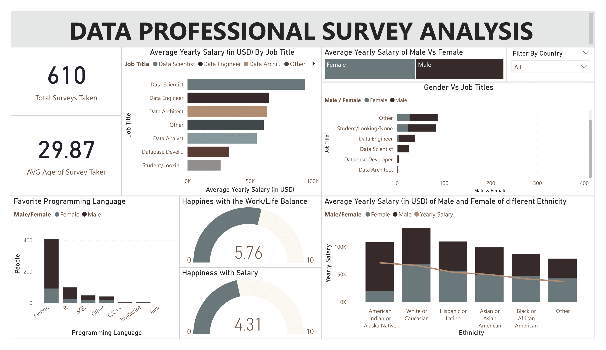

# Data Professional Survey Analysis

## Tools Used
- Microsoft Excel
- Power BI
- Tableau

## Project Type
- Analysis

## Relevant Links
- [View Live Tableau Dashboard](https://public.tableau.com/app/profile/george.bonga/viz/DataProfessionalSurvey_17401252043710/DataProfessionalSurveyDashboard)
- [Download Power BI Dashboard](https://github.com/GeorgeBonga/Data-Professional-Survey/blob/main/Data%20Professional%20Survey.pbix)

## Table of Contents
- [Background & Overview](#background--overview)
- [Data Structure Overview](#data-structure-overview)
- [Executive Summary](#executive-summary)

## Background & Overview
The data industry has experienced unprecedented growth in recent years, with organizations increasingly recognizing the value of data-driven decision-making. This comprehensive survey of 610 data professionals provides crucial insights into industry trends, career paths, and job satisfaction levels.

### Key Objectives
- Understanding the current landscape of data professional roles and responsibilities.
- Analyzing salary distributions across different data-related positions.
- Evaluating factors contributing to job satisfaction and career development.
- Identifying trends in career transitions into the data field.

## Data Structure Overview
The dataset consists of survey responses from **610 data professionals**, capturing their:
- **Demographics**: Gender distribution, ethnicity, and age.
- **Job Roles & Salaries**: Data Scientist, Data Engineer, Data Architect, Database Developer, Data Analyst, and others.
- **Programming Languages**: Python, R, SQL, C/C++, JavaScript, Java.
- **Job Satisfaction**: Salary happiness and work-life balance ratings.
- **Salary Breakdown**: By gender, ethnicity, and job role.

## Key Findings
### Salary Disparity
- **Highest Earning Role**: Data Scientists, earning an average of **$93,780**.
- **Lowest Earning Role**: Database Developers, earning **$40,000 – $50,000**.
- **Salary Gap**: A disparity of approximately **$50,000** between the highest and lowest-paying job roles.
- **Gender Pay Gap**: Relatively low, with female professionals earning more in some cases.
- **Male Dominance**: Males dominate across all job fields.

### Programming Language Preference
- **Most Popular Language**: Python.
- **Other Commonly Used Languages**: SQL (widely used among Data Analysts and Database Developers) and R.

### Gender Representation
- **Male professionals dominate the data industry**.
- **Women are underrepresented in high-paying roles** like Data Architect and Data Engineer.

### Job Satisfaction
- **Work-life balance satisfaction score**: **5.76/10** (relatively high satisfaction).
- **Salary happiness score**: **4.31/10** (lower than work-life balance, indicating some dissatisfaction).
- Many professionals are happy with job flexibility but dissatisfied with salary levels.

## Key Performance Indicators (KPIs)
- **Total survey participants**: **610**
- **Average age of respondents**: **29.87 years**
- **Happiness index scores**:
  - **Work-life balance happiness**: **5.76/10**
  - **Salary happiness**: **4.31/10**
- **Most used programming languages**:
  1. Python
  2. SQL
  3. R

 
  

  
  

## Executive Summary
The survey results reveal significant trends in the data industry. A majority of professionals transitioned into data careers from other fields. Salary levels vary widely, with an average yearly salary of **$93,780**. Job satisfaction is largely influenced by salary, work-life balance, and opportunities for growth. While **work-life balance is relatively positive**, salary dissatisfaction remains a concern. 

By addressing salary gaps and promoting career growth opportunities, organizations can enhance job satisfaction and industry inclusivity.

## Dashboard Overview

 

